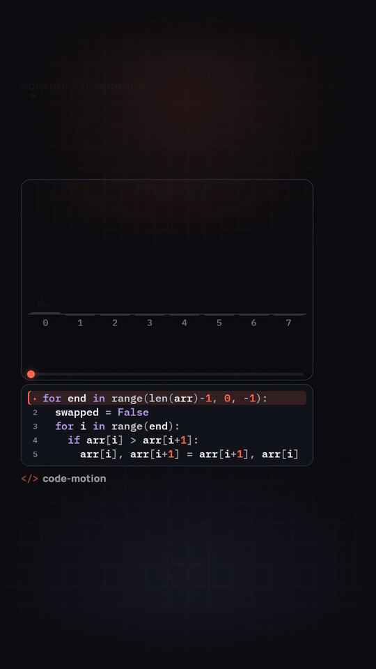
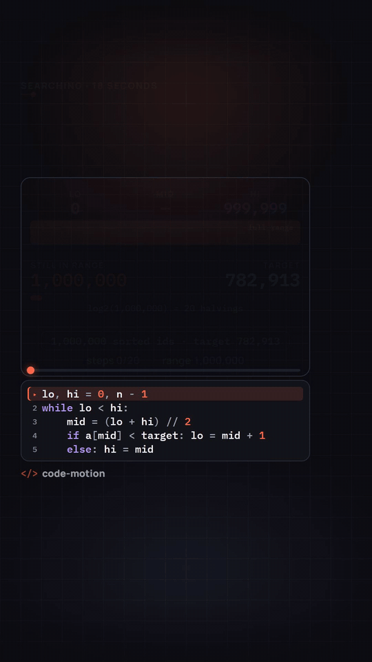
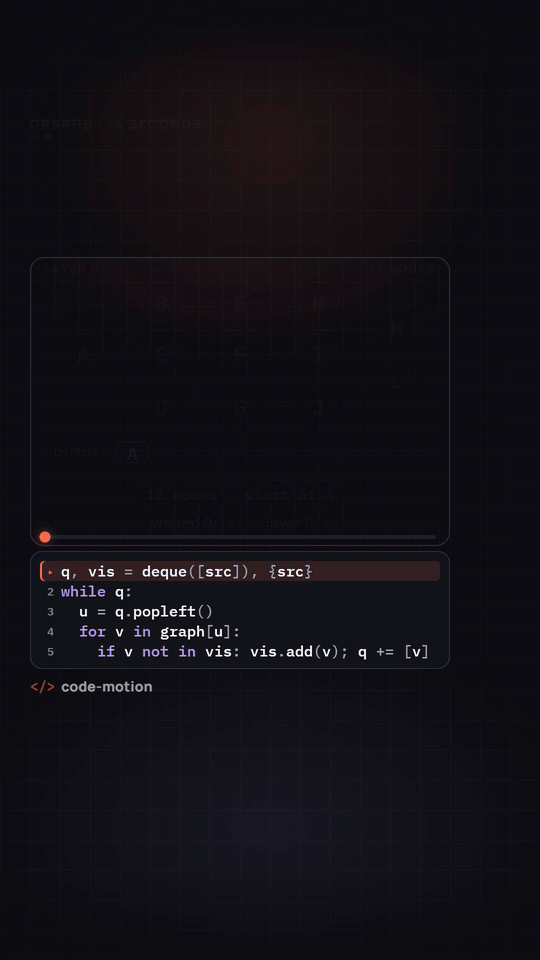

# code-motion

[](https://github.com/bytepatterns/code-motion/actions/workflows/check.yml)
[](LICENSE)
[](CONTRIBUTING.md)

**Algorithm explainer reels drawn entirely in code — 9:16, safe-zone verified, sound synced to the algorithm's own steps.**

| Bubble sort | Binary search | Breadth-first search |
|:---:|:---:|:---:|
|  |  |  |

<p align="center"><em>Every frame is React, every sound is synthesised.</em></p>

The sound is synthesised from raw PCM and every number in the hook is measured from a real run of the algorithm. No stock footage, no samples, no timeline editor — and two gates that fail the build if a label drifts under the platform UI or a sound misses its step.

This is the engine behind the [@bytepatterns](https://www.instagram.com/bytepatterns/) reels, trimmed to three example scenes and opened up as a template. Built on [Remotion](https://www.remotion.dev).

## Quick start

```bash
git clone https://github.com/bytepatterns/code-motion.git
cd code-motion
npm install                  # also synthesises the sound banks (npm run sfx)
npm run render:bubble-sort   # -> out/bubble-sort.mp4
npm run check                # safe-zone + sound gates over everything in out/
npm run studio               # live preview in the browser
```

Requirements: **Node 22.18+** (the scripts import the TypeScript sources directly through Node's type stripping — no build step), and **ffmpeg + ffprobe** on your PATH for the gates. Remotion downloads a headless Chromium on the first render.

| Command | What it does |
|---|---|
| `npm run render:all` | renders the three example scenes to `out/` |
| `npm run check` | runs verify-layout + verify-sound on every rendered scene, exits non-zero on failure |
| `npm run stills` | writes the middle frame of every scene to `docs/stills/` |
| `npm run sfx` | rebuilds the five synthesised sound banks into `public/sfx/` |
| `npm run render:preview:<style>` | the same bubble sort in each sound style, for A/B listening |
| `npm run typecheck` | `tsc --noEmit` |

## Examples

| Scene | Composition | Hook | What it shows | Full lesson |
|---|---|---|---|---|
| Bubble sort | `BubbleSortBars` | "Can you sort this in 12 swaps?" | 8 bars, pitch-mapped compares and swaps, each pass locking the right end | [bytepatterns.com](https://bytepatterns.com/learn/sorting/bubble-sort?utm_source=github&utm_medium=readme&utm_campaign=code-motion) |
| Binary search | `BinarySearch` | "1,000,000 items. Found in 20 steps." | a range bar that halves and zooms, a 20-step ladder | [bytepatterns.com](https://bytepatterns.com/learn/searching/binary-search?utm_source=github&utm_medium=readme&utm_campaign=code-motion) |
| Breadth-first search | `BreadthFirstSearch` | "BFS doesn't search. It spreads." | a 12-node graph laid out by computed distance, the live queue | [bytepatterns.com](https://bytepatterns.com/learn/graphs/breadth-first-search?utm_source=github&utm_medium=readme&utm_campaign=code-motion) |

The numbers in those hooks are not typed in: the scene runs the algorithm at module load and the hook, the chips, the counters and the code panel's closing comment all read the result. Change the input and every number on screen changes with it.

## The safe zone

Reels, TikTok and Shorts all draw their UI on top of your video. The intersection of the three is the only area you can trust:

```
 1080 x 1920
┌──────────────────────────────┐
│   top 230: camera, title     │
│  ┌───────────────────────┐   │
│  │ hook band   232-502   │   │
│  │ stage card  514-1092  │ ← │ right 180: like / comment / share rail
│  │ code panel 1102-1340  │   │
│  │ watermark  1350-1394  │   │
│  └───────────────────────┘   │
│   bottom 520: caption, audio │
└──────────────────────────────┘
  left 60        safe = x 60..900, y 230..1400
```

Every text, badge, bar, label, counter, code line and the watermark is placed from the tokens in `src/theme.ts` (`SAFE`, `ZONE`, `STAGE`). The grid texture and vignettes bleed to the edges on purpose, so the frame never looks letterboxed behind the platform chrome.

**`scripts/verify-layout.mjs` checks every frame, not a screenshot.** It streams the whole MP4 through ffmpeg as raw RGB, treats any run of 3+ pixels brighter than luma 70 as content, tracks the worst-case bounding box across the clip and exits 1 if a single content pixel ever leaves `x 60..900, y 230..1400`. A hook that is one character too long fails the build.

## Sound design

Sound is scheduled from the same step list that drives the animation, so it cannot drift from the picture:

| Event | Meaning | Example |
|---|---|---|
| `compare` | a read where nothing moves | two bars compared, a mid checked, a node dequeued |
| `swap` | something physically moves | bars exchange, half the range leaves, a ripple crosses an edge |
| `lock` | something is now settled | a slot is final, a BFS layer is done, a digit drops off "items left" |
| `final` | the closing chime | once, after the last step |

The bar sort is pitch-mapped: each value's rank picks a note on a pentatonic scale, so a pass literally plays the array. A shared scheduler (`finalizeSfx`) then rate-limits compares, drops a compare that is answered by the swap right after it, ducks anything that lands on an accent and applies the per-scene trim.

Five synthesised styles ship: `musical`, `tactile`, `arcade` (dense, −20..−14 LUFS) and `calm`, `calm-pad` (sparse, dark, −23..−20 LUFS, −8 dBFS true-peak ceiling). The examples render with `calm`; switch every scene at once with `DEFAULT_STYLE` in `src/audio/sfxEvents.ts`. There is no background music by design — trending audio is attached inside the platform at upload time.

**`scripts/verify-sound.mjs` is the second gate.** Per rendered MP4 it checks: an audio stream exists and the duration matches the timeline; integrated loudness (EBU R128) is inside the style's band and the true peak under its ceiling; the render is in sync with an offline premix (±3 frames); every event that is meant to be audible produces an onset within ±2 frames of its scheduled frame; no sample clips; the middle of the track carries level, not just the finale.

## Theming

`src/theme.ts` is the only file to edit to re-skin every scene:

- `COLOR` — canvas, surfaces, text ramp, `primary` (what to look at now), `secondary` (done / locked / progress), `warning`, `error`.
- `WATERMARK` — your handle (`text`), a short glyph (`mark`), opacity. Default: `</> code-motion`.
- `TYPE` — the type scale. Keep the hook at 72 px and value labels at 44 px or more; that is the watch-distance legibility floor.
- Fonts are loaded in `src/fonts.ts` (Manrope + IBM Plex Mono via `@remotion/google-fonts`).

One rule the gate enforces: the canvas and every decorative colour must stay at or under luma 70, and anything a viewer must read must sit above it. Scenes are dark by design.

## Try it in 60 seconds

1. **Install** — `git clone https://github.com/bytepatterns/code-motion.git && cd code-motion && npm install`
2. **Open the live preview** — `npm run studio`, then pick `BubbleSortBars` and press play.
3. **Change the input, watch every number follow** — edit `VALUES` in `src/algorithms/spec.ts` and save. The hook, the swap counter, the chips and the length of the clip update, because they are read from the run.

When you like it, `npm run render:bfs && npm run check -- bfs` renders the shortest scene to `out/bfs.mp4` and runs both gates on it — exactly what CI runs on every push (a few minutes on a laptop).

## Add a scene in 10 minutes

A scene is two files: a React-free scene module that runs the algorithm and lays out the clock, the code, the hook and the sound events, and a composition that draws one frame inside `<ReelFrame>`. Register it in two places, render, run the gates.

The whole contract — steps → events → code panel → hook rules → gates — is one file: **[SCENE-SPEC.md](SCENE-SPEC.md)**.

## Works with AI coding agents

The contract is a single file and the definition of done is a set of commands that exit non-zero, which is exactly the shape any AI coding agent works well with:

1. Give the agent [`prompts/new-scene.md`](prompts/new-scene.md) with the algorithm, the hook and the code you want filled in.
2. It reads [`SCENE-SPEC.md`](SCENE-SPEC.md) ([`AGENTS.md`](AGENTS.md) points there too), writes the scene module and the composition, registers them, renders, and runs `npm run check` until both gates pass.
3. It renders the middle frame with `npm run stills` and looks at it before reporting back.

You review a video that has already passed the layout and sound gates. The gates are the same whether a person or an agent wrote the scene, and they are not negotiable: if one fails, the scene is fixed — never the gate.

## Project layout

```
src/
  theme.ts              colours, type scale, watermark, safe-zone geometry
  fonts.ts              font loading
  Root.tsx              every composition
  template/             ReelFrame (hook band, stage card, scrubber), CodePanel, Watermark
  timeline/             the scene contract (spec.ts) and the registry every tool uses
  audio/                event scheduling, the <SfxTrack>, the generated bank manifest
  algorithms/           AlgoSpec + bubble sort (any sort renders through BarSort)
  scenes/               React-free scene modules: binary search, BFS
  compositions/         BarSort, BinarySearch, BreadthFirstSearch
scripts/
  make-sfx.mjs          the synthesiser (styles in scripts/lib/styles/)
  premix-sfx.mjs        offline mix used as the sync reference
  verify-layout.mjs     gate 1: safe zone, every frame
  verify-sound.mjs      gate 2: loudness, peak, sync, onsets, clipping
  check.mjs, stills.mjs
SCENE-SPEC.md           how to write a scene
prompts/new-scene.md    a ready-to-fill brief for an AI coding agent
```

## Follow along

New scenes ship as short videos and interactive lessons.

- Website: [bytepatterns.com](https://bytepatterns.com?utm_source=github&utm_medium=readme&utm_campaign=code-motion)
- YouTube: [@bytepatterns](https://www.youtube.com/@bytepatterns)
- Instagram: [@bytepatterns](https://www.instagram.com/bytepatterns/)
- TikTok: [@bytepatterns](https://www.tiktok.com/@bytepatterns)

## License

The code in this repository is [MIT](LICENSE) licensed. The sound banks are synthesised by the code, so they carry no third-party licence.

Two dependencies have their own terms: **Remotion** is source-available under the [Remotion License](https://www.remotion.dev/license) — free for individuals and small teams, a company licence is required above that threshold — and the fonts (**Manrope**, **IBM Plex Mono**) are under the SIL Open Font License and are fetched from Google Fonts at render time. See [CONTRIBUTING.md](CONTRIBUTING.md) to add a scene.
